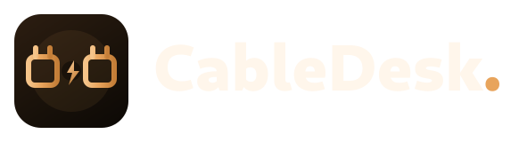

# CableDesk.

<p align="center">
  
</p>

<p align="center">
  <strong>Ultra-low-latency desktop control over a USB4 / Thunderbolt cable</strong><br/>
  GTK4 · libadwaita · Rust · Sunshine · Moonlight · Fedora Tier 1
</p>

<p align="center">
  <a href="LICENSE"></a>
  <a href="https://www.rust-lang.org/"></a>
  <a href="https://www.gtk.org/"></a>
  <a href="docs/ROADMAP.md"></a>
</p>

<p align="center">
  <a href="docs/CURRENT_STATUS.md">Status</a>
  ·
  <a href="docs/ROADMAP.md">Roadmap</a>
  ·
  <a href="docs/ARCHITECTURE.md">Architecture</a>
  ·
  <a href="CONTRIBUTING.md">Contributing</a>
  ·
  <a href="docs/OPEN_QUESTIONS.md">Open questions</a>
  ·
  <a href="data/brand/README.md">Brand</a>
</p>

> **Development paused — not ready for daily use.**
> Further work is deferred until Thunderbolt 4 hardware is available for
> physical two-machine testing. Compatibility detection and the direct-link
> networking/discovery stack (NetworkManager profile, hotplug, Avahi, peer
> validation, Polkit prepare) are implemented and unit/simulation-tested, but
> **have never been exercised against real Thunderbolt/USB4 hardware or a
> second machine**. Pairing and desktop streaming are **not implemented**.
> See [docs/CURRENT_STATUS.md](docs/CURRENT_STATUS.md) and
> [docs/ROADMAP.md](docs/ROADMAP.md).

CableDesk connects two Linux computers over a direct USB4 or Thunderbolt
cable and aims to provide a near-local desktop-control experience — plug in
a cable, and the laptop's desktop opens on the desktop computer. It is a
native GTK4/libadwaita automation layer around
[Sunshine](https://github.com/LizardByte/Sunshine) (host capture/encoding)
and [Moonlight](https://github.com/moonlight-stream/moonlight-qt) (client
decode/presentation), not a replacement for either.

CableDesk does not stream over the internet, does not use Wi-Fi as a
fallback, and is not a general-purpose remote-desktop tool.

## Why CableDesk?

Most remote-desktop tools assume the network already exists. CableDesk starts
from the cable: detect real USB4/Thunderbolt hardware honestly, prepare a
dedicated direct link, then hand capture and presentation to Sunshine and
Moonlight. Built to feel like it could ship with Fedora Workstation —
Wayland-first, Polkit/SELinux-aware, no Electron.

> An ordinary USB-C cable and port are **not** enough. USB-C alone does not
> mean USB4 or Thunderbolt. CableDesk will tell you when the hardware isn't
> compatible instead of assuming it from the connector shape.

## Current status (Phase 2 of 7)

**Paused.** Development is on hold until Thunderbolt 4 hardware is available;
that cable link is required for further testing beyond simulation.

Authoritative board: [docs/CURRENT_STATUS.md](docs/CURRENT_STATUS.md) ·
[docs/ROADMAP.md](docs/ROADMAP.md).

### Done (software)

- Cargo workspace, state machine, cable-only error model
- Fedora `PlatformBackend` + NM/Avahi/route/classify/peer libraries
- Development-only simulation (`cabledeskctl simulate`, Cargo feature)
- Agent: hotplug → helper prepare → Avahi → `validate_cable_peer` →
  `PairingRequired`; cable loss returns to `WaitingForCable`
- Helper: Polkit-gated `PrepareDirectLink` (rejects non-direct ifaces)
- CLI: `compatibility`, `status`, `session`, `repair-network`, …
- GTK UI: compatibility groups + live Session panel
- Packaging scaffolding (RPM spec, systemd, Polkit, firewalld zone)

### Not done yet

- **Physical USB4/Thunderbolt / two-machine validation**
  ([docs/HARDWARE_TEST_PLAN.md](docs/HARDWARE_TEST_PLAN.md))
- Pairing (Phase 3), streaming (Phase 4), polish (Phase 5)
- RPM/`rpmlint` build verification

```bash
cargo run -p cabledeskctl --features simulation -- simulate demo
cargo run -p cabledesk-agent &
cargo run -p cabledeskctl -- session
```


## Supported systems

**Tier 1** (actively developed): **Fedora Workstation, GNOME, Wayland,
x86_64, SELinux enforcing, firewalld enabled.**

Other distributions are planned — see [docs/DISTRO_SUPPORT.md](docs/DISTRO_SUPPORT.md).
Do not assume CableDesk works there yet.

## Getting started (development)

CableDesk is not packaged for end users yet.

```bash
git clone https://github.com/loafdaddy/CableDesk.git
cd CableDesk
./scripts/dev-setup.sh      # checks/installs development dependencies (asks first)
./scripts/dev-build.sh      # cargo fmt --check, build, clippy, test
./scripts/dev-install.sh    # installs user-level files; asks before any root/system changes
```

```bash
cabledeskctl compatibility   # hardware/compatibility report
cabledesk                    # GTK UI (compatibility + live Session)
systemctl --user start cabledesk-agent   # background agent
cabledeskctl status          # connection state
cabledeskctl session         # JSON session snapshot (iface, peer, errors)
cabledeskctl repair-network  # Polkit-gated prepare via cabledesk-helper
./scripts/dev-uninstall.sh   # remove what the scripts installed
```

```bash
# Development-only simulation (never enable in production packages)
cargo run -p cabledeskctl --features simulation -- simulate demo
```

## Documentation

| Doc | What it covers |
|-----|----------------|
| [docs/PROJECT_PLAN.md](docs/PROJECT_PLAN.md) | Goals, phases, non-goals |
| [docs/ARCHITECTURE.md](docs/ARCHITECTURE.md) | Component layout and data flow |
| [docs/SECURITY.md](docs/SECURITY.md) / [docs/THREAT_MODEL.md](docs/THREAT_MODEL.md) | Security model |
| [docs/NETWORKING.md](docs/NETWORKING.md) | `thunderbolt-net`, NetworkManager, discovery |
| [docs/POWER_DELIVERY.md](docs/POWER_DELIVERY.md) | USB-C PD and charging research |
| [docs/UPSTREAM_INTEGRATION.md](docs/UPSTREAM_INTEGRATION.md) | Sunshine / Moonlight integration |
| [docs/PACKAGING.md](docs/PACKAGING.md) | RPM packaging and hardening |
| [docs/ROADMAP.md](docs/ROADMAP.md) | Phased plan |
| [docs/CURRENT_STATUS.md](docs/CURRENT_STATUS.md) | Audited phase status |
| [docs/HARDWARE_TEST_PLAN.md](docs/HARDWARE_TEST_PLAN.md) | Deferred physical tests |
| [docs/adr/](docs/adr/) | Architecture decision records |
| [data/brand/README.md](data/brand/README.md) | Lockup, mark, palette |

## License

GPL-3.0-or-later. See [LICENSE](LICENSE). CableDesk depends on and manages
Sunshine and Moonlight, both also GPL-licensed — see
[docs/UPSTREAM_INTEGRATION.md](docs/UPSTREAM_INTEGRATION.md).

## Contributing

See [CONTRIBUTING.md](CONTRIBUTING.md). Contributors are welcome — research,
Rust, GTK, packaging, docs, and hardware testing all help.
